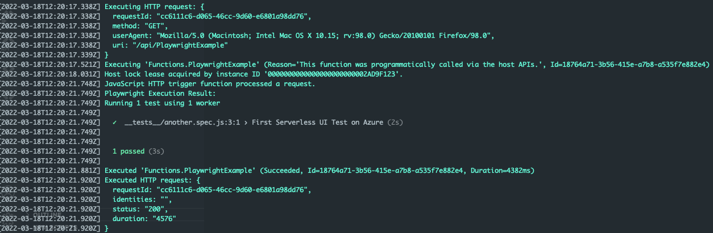

# event-driven-ta-azure

# Short introduction - more is coming soon

This is example is running playwright in a Azure Function. 

Do the following to get started: 
1. Clone the repo
2. cd event-driven-ta-azure
3. run `func start --build --verbose`
4. call the provided url (something like that): `http://localhost:7071/api/PlaywrightExample`
5. check the output

More information can be found at: 
[Here](https://docs.microsoft.com/de-de/azure/azure-functions/functions-create-function-linux-custom-image?tabs=in-process%2Cbash%2Cazure-cli&pivots=programming-language-javascript) you can start

That is my outcome: 
